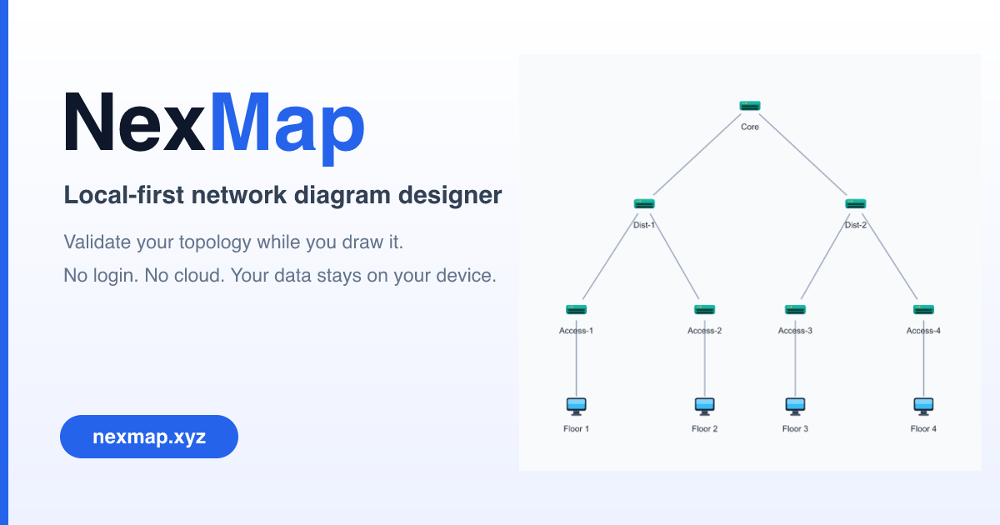
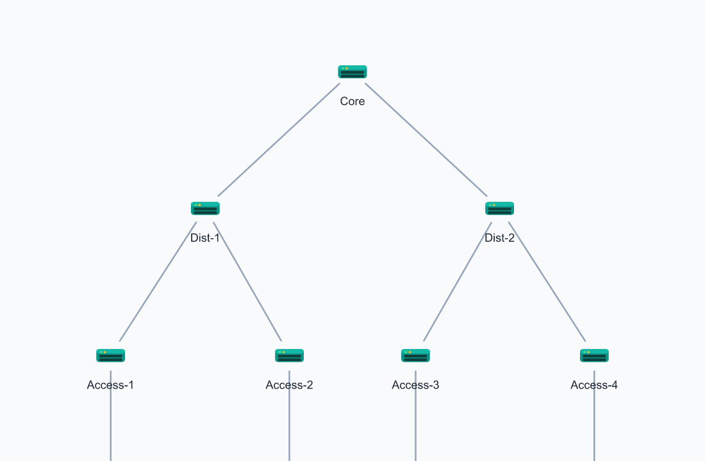
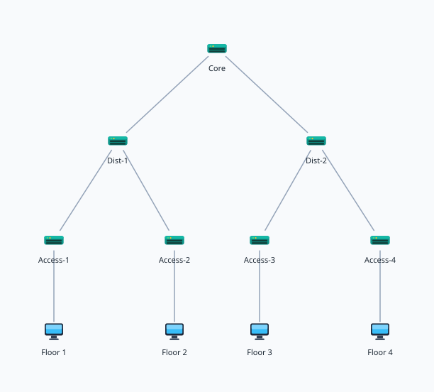
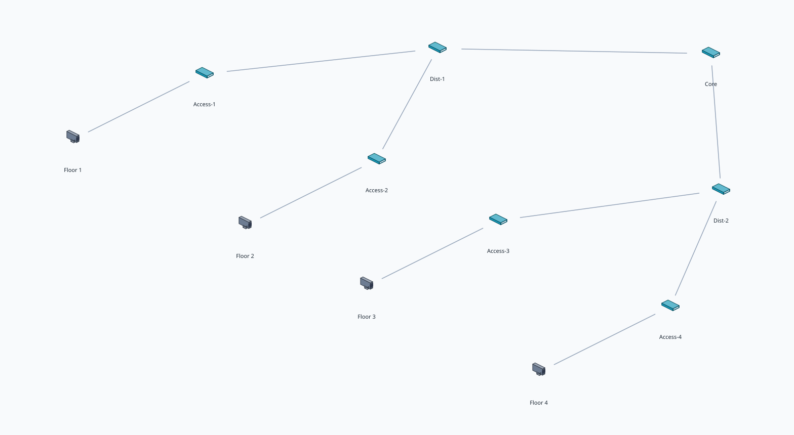
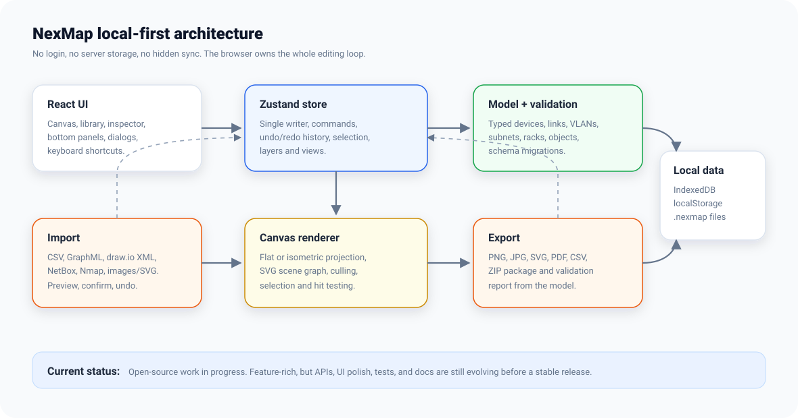
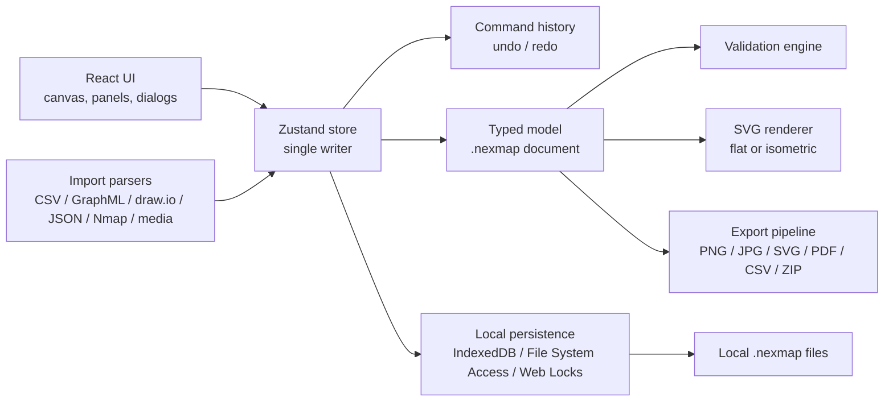
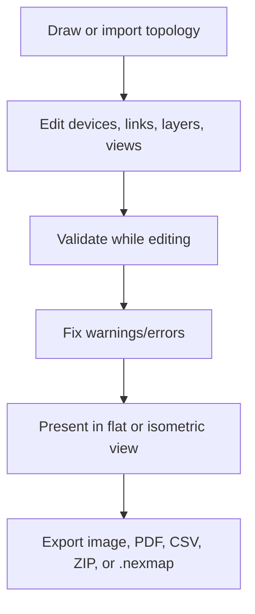

# NexMap

**NexMap is a local-first network infrastructure designer that validates your
diagram while you draw it.**

**▶ Try it live: [nexmap.xyz](https://nexmap.xyz/)** — runs entirely in your
browser, no login, nothing leaves your device.

It runs in the browser, has no login, and keeps project data on the user's
machine through IndexedDB and `.nexmap` files. The long-term goal is an open
source alternative to heavyweight network diagramming tools: fast enough for
daily design work, structured enough for real infrastructure documentation, and
pleasant enough to present.

> **Project status:** work in progress. NexMap is feature-rich, but it is not a
> stable release yet. Expect UI polish gaps, changing file/schema details, missing
> contributor docs, and rough edges around advanced workflows.

[](https://nexmap.xyz/)

## Demo

The editor renders the same model in a flat 2D view and an isometric 3D view. The
loop below is generated straight from NexMap's own export pipeline (a real starter
template, no mockups) — flat device-model icons in 2D, true 3D models on an
isometric stage. Regenerate it any time with `npm run gen:readme-media`.



| Flat (2D) | Isometric (3D) |
| --- | --- |
|  |  |

## Current State

NexMap already has the core of a usable local network designer:

- **Canvas editing:** drag/drop device library (icons track the active view), pan/zoom,
  marquee select, lasso, smart snap/alignment guides, grouping, lock/unlock, z-order,
  copy/cut/paste, keyboard nudge, context menus, resize handles, and undo/redo. Moving a
  group carries its connectors rigidly (bends and all) when both endpoints move.
- **Pointer-native input:** one unified gesture core drives mouse, trackpad, pen, and
  touch — wheel-pan or wheel-zoom (configurable), pinch-to-zoom, two-finger pan, and a
  survivor-keeps-panning multitouch model. Double-click empty canvas to quick-create a
  device at the point; a "quiet canvas" fades chrome once you're heads-down and a floating
  selection toolbar puts the common actions right by the selection.
- **Annotations & callouts:** movable rich-text callout boxes (heading / subheading /
  body with **bold**, *italic*, `code`, bullet/numbered lists, and alignment) connected to
  any device by an editable colored dotted leader line — drag the anchor handle onto a
  target or use the toolbar. Callouts render in flat, isometric, and every export.
- **Connectors:** semantic links (VLAN/trunk, LACP, circuit IDs, interfaces), drag-to-relink
  endpoints, waypoints, straight/orthogonal routing, manual color, and a thickness slider.
- **Flat + isometric rendering:** toggle between 2D and isometric view without
  changing the canonical flat model. Flat mode uses detailed flat device-model
  icons; isometric mode renders true 3D models on a lit stage with grounded
  shadows and cable-on-floor connectors, and an animated tilt plays on switch.
  Both projections cover grid, upright labels, hit testing, editing, and export.
- **Component detail:** FossFLOW-style floating info cards above each node (name +
  rich-text description), inline rename on canvas, vendor/model/role combo fields
  with presets, and per-node icon-size / label-height controls.
- **Starter templates:** 18 one-click templates on the start screen, grouped into
  Home & small office (Wi-Fi, mesh, smart home, home office, gaming, home lab,
  apartment) and Enterprise & data center (branch, three-tier campus, DMZ, data
  center rack, WAN hub-and-spoke, HA core, hybrid cloud, wireless campus).
- **Network model:** typed devices, first-class interfaces/ports (name, media,
  speed, access VLAN, front/rear face) that links can reference per endpoint, plus
  text notes, shapes/zones, image/SVG underlays, VLANs, subnets, racks, layers,
  saved views, and `.nexmap` documents.
- **Locations:** a site → building → floor → room → row tree, so every rack,
  device, and port has a real address like `HQ/28/RK001/SW01/Gi1/0/13`. Paths are
  derived, never stored, so a rename can't leave a stale copy behind. A tree
  navigator selects everything placed at a location, and legacy free-text site
  names convert in one undoable step.
- **Cable tracing:** follow a circuit port by port through patch panels — front
  jack to rear punchdown to the next hop — and see *why* a trace stopped
  (terminated, un-patched, looped, ambiguous). Clicking a hop jumps to that port.
- **Diagram vs reality:** a Cabling panel compares what you DESIGNED (`links`)
  against what is actually PATCHED (`rackCables` plus pass-throughs) and reports
  the delta — documented-and-patched, designed-but-not-cabled, and cabled-but-
  undocumented. Only rack-mounted gear is in scope, so a diagram drawn without
  racks stays quiet.
- **Focus dimming:** selecting anything demotes everything else, in both
  designers, so a dense diagram or a 42U cabinet reads at a glance.
- **Validation:** duplicate IP/name, invalid IP/CIDR, missing link endpoints,
  overlapping subnets, VLAN range/duplicates, IP outside subnet, missing gateway,
  trunk/access mismatch, orphaned devices, and rack RU collisions/overflow.
- **Import:** CSV devices/links/IP plans/VLANs, GraphML, uncompressed draw.io XML,
  topology JSON, NetBox-style JSON/CSV flows, Nmap XML, image underlays, and
  sanitized SVG underlays. Imports preview before commit and undo as one action.
- **Export:** PNG, JPG, SVG, PDF, inventory CSV, links CSV, and ZIP packages with
  `.nexmap`, renders, CSVs, and validation reports. Export can honor the current
  isometric projection.
- **Local persistence:** IndexedDB autosave, recovery dialog, Web Locks
  single-writer protection, File System Access save/open when supported, download
  fallback elsewhere, offline/PWA shell, and settings for theme/connect behavior.
- **Rack designer:** a dedicated elevation editor with realistic per-vendor faceplate
  art (Cisco/Arista/Juniper switches, Dell/HPE servers, APC UPS, Panduit patch panels,
  firewalls, PDUs) plus a parametric fallback for everything else; single-rack and
  side-by-side row views, front/rear faces, drag-to-mount at any U, port-to-port cabling
  with color and labels, and PNG/PDF/CSV cable-schedule export. Push device names off the
  faceplates into a callout column with **Annotate all**, **Hide names**, and generated
  **title block** / **legend** blocks for document-grade elevations.
- **Tooltips:** a body-level tooltip singleton that can't be clipped by scroll
  containers, covering the toolbars, zoom clusters, dialogs, and canvas affordances.
- **Polish already underway:** auto-layout, canvas search, alignment/distribution,
  presentation/read-only mode, responsive shell, keyboard shortcuts, light/dark themes,
  and an error boundary around the canvas.

## What Is Not Ready Yet

These are the main reasons the project should still be treated as WIP:

- No stable release process or published package yet; `CHANGELOG.md` does not yet
  enforce minor/patch semantics.
- File format/schema may still evolve before a stable `1.0`. The current on-disk
  version is schema v5; migrations are forward-only and a newer-than-supported
  file is refused rather than silently downgraded.
- Advanced routing is still basic; obstacle avoidance is future work.
- The rack designer still has two views (row and single-rack). Port-level work no
  longer needs the single-rack drill-in, but callouts, cable mini-controls,
  marquee, and place-at-U remain single-rack only.
- Cable tracing follows one unambiguous path. A port carrying two cables reports
  the ambiguity rather than guessing, and only patch panels are treated as
  pass-through.
- Browser/E2E coverage is still lighter than the unit coverage.
- Accessibility, mobile/tablet ergonomics, and large-diagram performance still
  need more real-user testing.

## Architecture







## Quick Start

```bash
npm install
npm run dev        # Vite dev server, usually http://localhost:5173
npm test           # Vitest unit tests
npm run typecheck  # TypeScript project check
npm run lint       # ESLint
npm run build      # production build
```

If port `5173` is busy, Vite will choose another local port.

## Deploy (Cloudflare)

NexMap builds to a static SPA, so it hosts as plain assets — there is no backend,
no database, and no stored or synced project data on the server. It deploys to
both Cloudflare Workers (Static Assets) and Cloudflare Pages. The live instance
runs at [nexmap.xyz](https://nexmap.xyz/).

```bash
npm run deploy:check     # build + wrangler dry-run (validate, no upload)
npm run deploy:workers   # build + deploy to Cloudflare Workers  (*.workers.dev)
npm run deploy:pages     # build + deploy to Cloudflare Pages     (*.pages.dev)
```

The first deploy prompts `wrangler login` (one-time OAuth). Config lives in
`wrangler.toml` (assets-only). The SPA fallback is handled by
`not_found_handling = "single-page-application"` there — not by a `_redirects`
rule, which Cloudflare's asset validator rejects as a loop. Caching and security
headers come from `public/_headers`, which Vite copies into `dist/`.

For Pages via the dashboard instead of the CLI: build command `npm run build`,
output directory `dist`.

## Project Layout

```text
src/
  model/        pure types, schema, migrations, validation
  store/        Zustand store, command history, single-writer model updates
  canvas/       SVG canvas, flat/iso projection, gestures, toolbar, rendering
  io/           import and export pipelines
  persistence/ IndexedDB drafts, File System Access, Web Locks, recovery
  lib/          CSV, IP/CIDR, spatial index, layout, geometry helpers
  ui/           shell, sidebars, inspector, bottom panels, dialogs
scripts/        documentation media generation (real renders via the export pipeline)
docs/assets/    README visuals and generated documentation media
```

## Data And Privacy

NexMap is designed to be local-first:

- No account system.
- No required backend.
- No hidden cloud sync.
- Autosaves live in browser storage.
- Durable project files are saved as `.nexmap` JSON on the user's machine.

Clearing browser data can remove autosaved drafts. Export or save a `.nexmap`
file when the project matters.

## Roadmap

The detailed roadmap lives in [`TODOS.md`](TODOS.md). Near-term open-source work
should focus on:

- retiring the single-rack drill-in once callouts, cable mini-controls, marquee
  and place-at-U work in the unified row canvas — the remaining half of
  [`docs/designs/spatial-model-and-tracing.md`](docs/designs/spatial-model-and-tracing.md);
- release notes and a published release process;
- better connector routing (obstacle avoidance);
- word-level rich-text editing and swatch chips in callout legends;
- guided discovery import;
- performance and accessibility passes on large diagrams.

## Tech Stack

React 18, TypeScript, Vite, Zustand, Vitest, SVG rendering, IndexedDB, File System
Access API where available, Web Locks, fflate, DOMPurify, and jsPDF.

## License

See [`LICENSE`](LICENSE).
